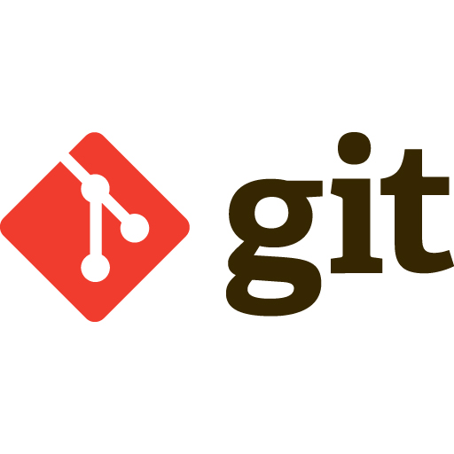

<h1 align =center> Hi there 👋 I'm Amin Koupaie</h1>
<h3 align =center> An ambitious junior frontend web developer.</h3>
<h3> About me </h3>
- 🔭 I’m currently working on Educational React Project to develope an expense tracker 
- 🌱 I’m learning React JS via projects 
- 👯 I’m looking to collaborate on any web development projects 
- 🤔 Any career advice is welcomed. 
- 💬 Ask me about HTML,CSS,JavaScript and React 
- 📫 You can email me at amin.aoka@gmail.com 
<h3 align="left">Languages and Tools:</h3>

 

  
 

<!--
**amin-aoka/amin-aoka** is a ✨ _special_ ✨ repository because its `README.md` (this file) appears on your GitHub profile.

Here are some ideas to get you started:

- 🔭 I’m currently working on ...
- 🌱 I’m currently learning ...
- 👯 I’m looking to collaborate on ...
- 🤔 I’m looking for help with ...
- 💬 Ask me about ...
- 📫 How to reach me: ...
- 😄 Pronouns: ...
- ⚡ Fun fact: ...
-->
